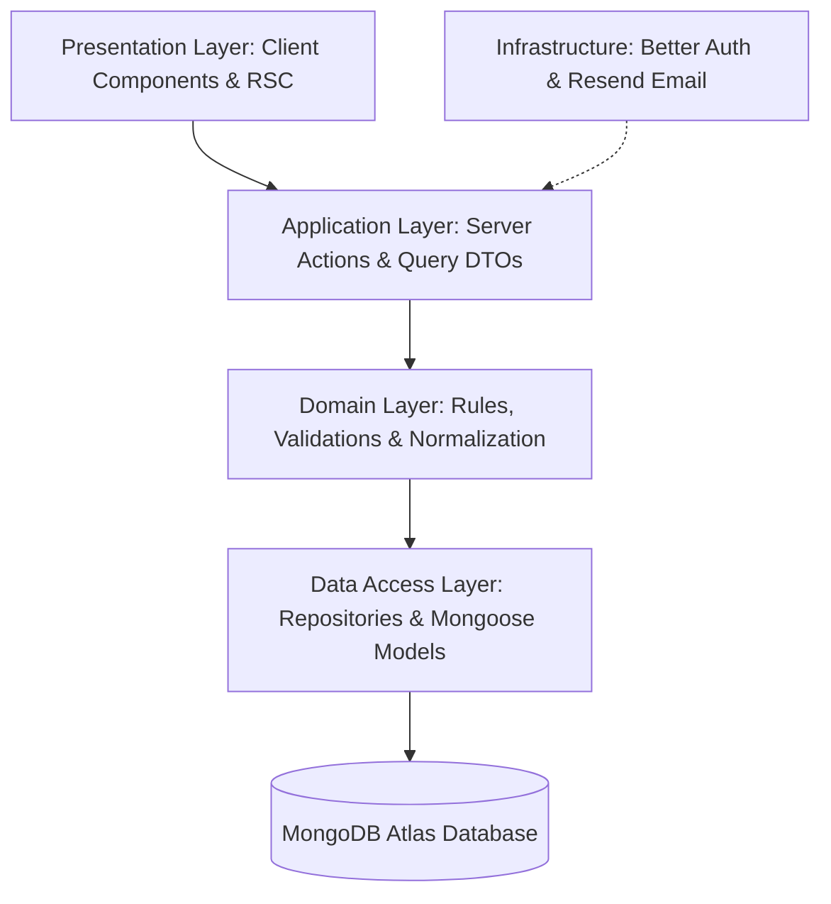
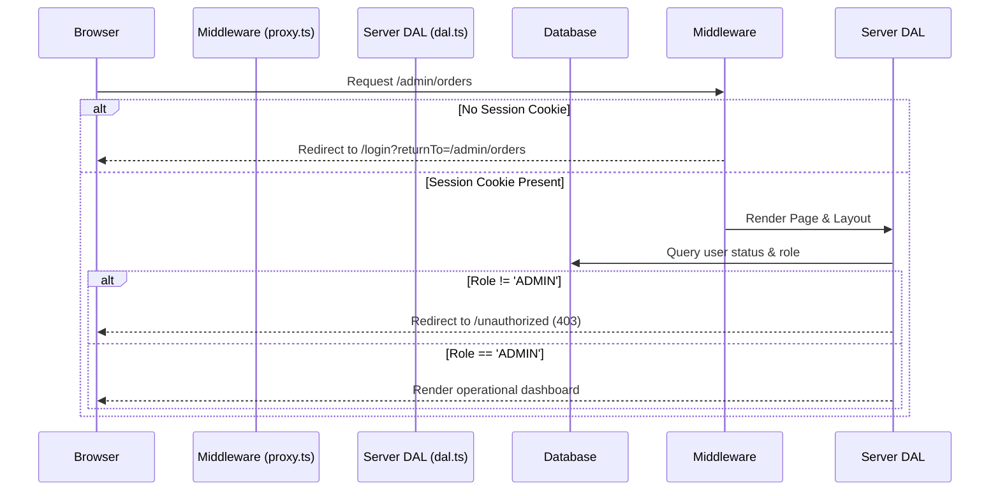

# Architecture: Authentication, Authorization & System Design
**Author / Developer: Hassan Abdelhamed**

This documentation provides an in-depth technical overview of the implementation, design patterns, security controls, and front-end architectures engineered for **Afnan**, a premium e-commerce platform for handmade Egyptian products.

---

## 1. Modular Monolith Architecture & Design Layers

The application is structured as a **modular monolith**, isolating concerns into logical boundaries while maintaining a unified runtime and database.



### Layer Breakdown

1. **Presentation Layer (`src/app/` & `src/components/`)**
   - Combines Next.js React Server Components (RSC) for fast initial paint and SEO with Client Components (`"use client"`) for rich interactive interfaces.
   - Houses form layouts, global layout shells, headers, and theme wrappers.

2. **Application Layer (`src/modules/` Actions & Queries)**
   - Houses Next.js Server Actions representing application commands (e.g., `loginAction`, `registerAction`).
   - Acts as entry point orchestrators, mapping inputs to output DTOs using `ActionResult<T>`.

3. **Domain Layer (`src/modules/` Schemas, Phone, & Money Rules)**
   - Holds core business logic, including currency integer storage (EGP minor units), phone normalization rules, and input validation schemas via Zod.

4. **Data Access Layer (DAL) (`src/modules/` Repositories & Models)**
   - Handles raw Mongoose queries, projections, indexes, and write transactions.
   - Houses security boundary guards (`requireUser`, `requireAdmin`).

5. **Infrastructure (`src/lib/`)**
   - Adapts database drivers, Better Auth instance adapters, Resend email clients, and system error handlers.

---

## 2. Authentication System (Better Auth Setup)

We integrated **Better Auth** with Next.js App Router for session management.

```
Guest Link (Sign In) ──> Login Form ──> Action (signInEmail) ──> Client Session Set
```

### Key Configurations (`src/lib/auth/auth.ts`)
- **Adapter**: `mongodbAdapter` targeting MongoDB Atlas collections directly.
- **Auto-Sign In**: Configured `autoSignIn: false` during registration to prevent session hijacking and email address enumeration leaks.
- **Session Duration**: Set `expiresIn` to 7 days, with `updateAge` set to 24 hours to automatically roll and refresh active session tokens.
- **Security Protections**: Set the first admin account and customer role protections as non-mutable (`input: false` inside additional user fields configuration) to block mass assignment injection attacks.
- **Stale Signouts**: Created a timeout buffer inside client layout components. Signouts first call Better Auth's `signOut()` client API, display a success toast message, and execute Next.js router refreshes after `800ms`.

---

## 3. Authorization & Route Protection Mechanics

Security is enforced at multiple layers: Client-side routing, optimistic proxying, and authoritative server-side DAL layout guards.



### Authorization Levels

| Mechanism | Component | Logic | Purpose |
|---|---|---|---|
| **Optimistic Proxy** | `src/proxy.ts` | Checks `getSessionCookie()` matching in route middleware. | Fast client-side redirection for guest traffic away from `/account/*` or `/admin/*`. |
| **Reverse Auth Proxy** | `src/proxy.ts` | Intercepts active sessions requesting `/login` or `/register`. | Redirects authenticated sessions away from public sign-in forms to `/`. |
| **Server DAL Guard** | `src/modules/auth/dal.ts` | Calls `requireUser()` and `requireAdmin()` on RSC render phase. | Authoritatively checks database state and user status (`ACTIVE` vs. `SUSPENDED`). |
| **Layout Level Enforcements** | `admin/layout.tsx` & `account/layout.tsx` | Wraps page trees in `try/catch` validation blocks. | Intercepts `UnauthenticatedError` to request login, and redirects `ForbiddenError` to `/unauthorized`. |

---

## 4. UI/UX & Editorial Design System Integration

All authentication forms and layout controls strictly follow the **Afnan Editorial Design System** guidelines.

### Design Principles Implemented
- **Zero Shadows**: Removed all drop shadows (`shadow-*`) from all form buttons, frames, and dialogs. Grouping and separation rely entirely on hairline borders and tonal background changes.
- **Sharp Corners (0px Roundedness)**: Replaced default rounded classes with sharp 90-degree corners for inputs, indicators, buttons, and alert components.
- **Interactive initials Badge**: Replaced generic user SVG outline icons in the header with a personalized square initial badge (e.g. `[H]` for Hassan) which triggers a click-outside navigation dropdown.
- **Interactive Chevron**: Placed a small downward chevron that transitions to rotate 180 degrees when the user profile menu opens.
- **Live Password Complexity Bullets**: Designed custom square validation status bullets. The component validates password complexity in real time, shifting opacities and colors to brand primary colors (`text-on-background bg-primary`) as length, number, and special character rules are satisfied.

---

## 5. Security & Robustness Checklist

- **Reverse Directives**: Prevented redirection vulnerabilities by validating query path parameters through `getSafeReturnTo()`, rejecting arbitrary URLs starting with `//` or non-relative schemes.
- **Production Error Masking**: In the custom client `error.tsx` boundary page, the raw diagnostic details container is wrapped in a check for `process.env.NODE_ENV === "development"`. Production deployments show a generic safe error banner to prevent stack/database leakage.
- **Phone Normalization**: Normalized Egyptian mobile inputs to the standard E.164 (`+20...`) formatting during registration check actions, rejecting malformed telephone entries.
- **Unique Constraints**: Checked email and phone number uniqueness inside `registerAction` to return specific, inline validation error messages to the client rather than relying on raw database driver violations.
- **Direct Database Querying**: Resolved same-request redirect issues by querying user roles directly from the MongoDB collection (`findOne`) instead of reading cookie request headers during authentication actions.

---

## 6. Database Collections & Indexing Scheme

The authentication collections are persisted inside MongoDB Atlas and managed dynamically by Better Auth's adapter alongside Mongoose database connections.

### Key Collections & Schema Extensions

1. **`user` Collection**: Stores primary account profiles.
   - Customized with additional schema attributes (`phoneE164`, `whatsappE164`, `role`, `status`).
   - Enabled unique indexes on `email` and `phoneE164` to prevent double-registrations.
2. **`session` Collection**: Stores active authenticated sessions.
   - Extends the baseline user session to hold validation keys (`userId`, `token`, `expiresAt`, `ipAddress`).
3. **`account` Collection**: Maps user identities to oauth and credential records.
4. **`verification` Collection**: Manages security tokens for reset password flows.

---

## 7. Environment Configurations & Settings

To initialize the authentication runtime, standard environment settings must be configured inside your local `.env.local` files:

```bash
# Database Coordinates
MONGODB_URI="mongodb+srv://..."
MONGODB_DB_NAME="afnan"

# Better Auth Credentials
BETTER_AUTH_SECRET="your-better-auth-secret-key"
BETTER_AUTH_URL="http://localhost:3000"

# Application Domains
NEXT_PUBLIC_APP_URL="http://localhost:3000"

# Resend Transactional Email Provider
RESEND_API_KEY="re_..."
EMAIL_FROM="Afnan <noreply@...>"
```

---

## 8. Automated Verification & Testing Suite

We implemented an automated unit test suite using **Vitest** to guarantee core validation functions, phone conversions, and Server Action redirect behaviors remain robust during revisions.

### Tested Areas

- **Money Calculations**: Verifies minor units transformations (`EGP 10.00` to `1000`).
- **Phone Normalizations**: Validates raw input strings mapping correctly to standard Egyptian E.164 configurations (`+20...`).
- **Redirect Validations**: Checks path parsing to prevent open-redirection security issues.
- **Form Validation Hooks**: Tests client-side validation hook responsiveness.
- **Server Action Mocks**: Simulates API sign-ins and verifies routing outcomes.

### Commands to Run the Test Suite

```bash
# Run unit test suite once
pnpm test run

# Run unit tests in watch mode during development
pnpm test

# Run type checker to verify code consistency
pnpm typecheck
```
