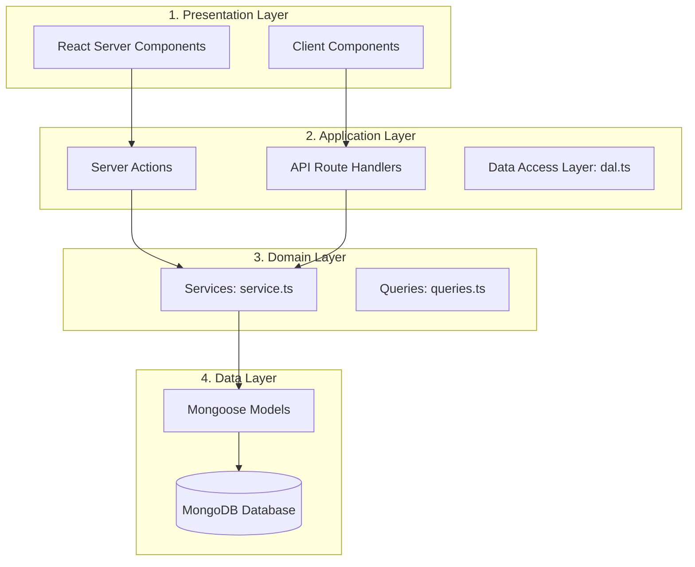

# Modular Monolith Architecture & Layer Mapping

This document explains the architecture of the **Afnan** codebase. It maps the Next.js App Router conventions to classic Express/REST architectural layers (Controllers, Services, Repositories).

---

## 1. Architectural Layers Overview

We use a **modular monolith** divided into four logical layers. Each layer has specific responsibilities:

---

## 2. Next.js vs. Express Layer Mapping

If you are coming from an Express.js background, here is how the architectural patterns compare:

| Express Concept | Next.js / Monolith Equivalent | File Location | Responsibility |
| :--- | :--- | :--- | :--- |
| **REST Router & Controller** | **API Route Handler** | `src/app/api/.../route.ts` | **HTTP Controller**: Intercepts standard GET/POST/PUT/DELETE requests for external webhooks, integrations, or background uploads. |
| **Form Handler / Controller** | **Server Action** | `src/modules/.../actions.ts` | **RPC Controller**: Direct, server-side function endpoints bound to React client-side forms. Bypasses REST configuration. |
| **Request Parser / Validator** | **Zod Schemas** | `src/modules/.../schemas.ts` | **Validator**: Validates and normalizes request payloads on both client and server boundaries. |
| **Service File** | **Service / Queries** | `src/modules/.../service.ts`   `src/modules/.../queries.ts` | **Business Domain**: Holds money calculations, stock adjustments, database queries, and notifications. Has no dependency on request/response headers. |
| **ORM / ODM Model** | **Mongoose Schema & Model** | `src/modules/.../model.ts` | **Data Access Schema**: Represents database schemas, validation rules, collections, and indexes. |

---

## 3. The Execution Flow

Here is how a typical request flows through the codebase during a customer operation (e.g. creating an order):

### Step A: The Presentation Layer
The browser displays a form component. When the user clicks "Submit", the browser directly invokes a Server Action.

### Step B: The Application Controller Layer (Server Action)
The Server Action acts as the **Controller**. It:
1.  Verifies the user's session using the central authorization DAL (`requireUser`).
2.  Parses parameters using a Zod schema (`orderSchema.safeParse`).
3.  Delegates database and business mutations to the **Service Layer**.
4.  Catches any errors and returns a formatted JSON `ActionResult` object (`actionSuccess` / `actionFailure`).

### Step C: The Domain Service Layer
The Service Layer contains the **business logic**. It:
1.  Initializes a Mongoose connection (`await connectMongoose()`).
2.  Executes database transactions (e.g. subtracting product stock, creating order snapshots).
3.  Sends email alerts (best effort, preventing failures from breaking transactions).

---

## 4. Why Separate Actions (Controllers) from Services?

We do not put Mongoose queries or stock updates directly inside Server Actions. Separating them into a dedicated Service Layer provides several benefits:

1.  **Deduplication**: The same validation or database update logic can be called by a **Server Action** (for web forms) AND an **API Route** (for mobile apps or webhook endpoints) without duplicating the code.
2.  **Testability**: You can write clean unit tests for your business service functions without needing to mock Next.js routing interfaces, headers, or navigation APIs.
3.  **Clean Boundaries**: Keep Server Actions small and thin. This helps prevent business logic leaks into your page files.
