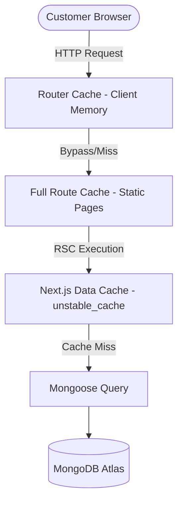
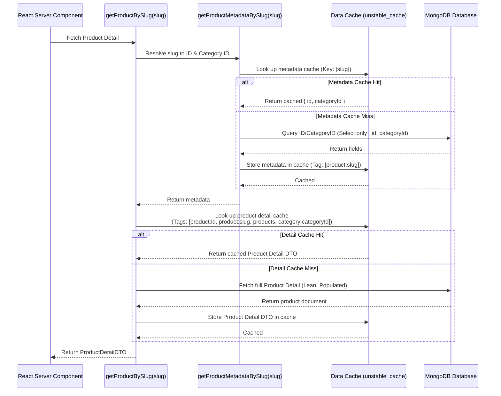

# Caching & Storefront Freshness Architecture

This document provides a comprehensive technical guide to the caching strategy, cache tags, lifetimes (TTL), invalidation mechanics, and test validation for the **Afnan** handmade products e-commerce platform. 

---

## 1. Core Principles of Caching in Next.js & Mongoose

Next.js App Router patches `fetch` to enable automatic request caching and Data Caching. However, database operations using Mongoose (MongoDB) do not use `fetch` and must use Next.js's **`unstable_cache`** API to persistent-cache queries across requests and sessions.

### Caching Layers Defined



1.  **Request Memoization (fetch cache)**: Automatically deduplicates identical read queries during a single render pass.
2.  **Next.js Data Cache (`unstable_cache`)**: Persists database query outputs across client requests and build times. This is where Mongoose queries are stored.
3.  **Full Route Cache**: Automatically caches static page assets/RSC payloads on the server.
4.  **Router Cache**: Client-side in-memory cache of page routes.

---

## 2. Persistence Cache Configuration & Tag Taxonomy

The system defines all cache tags in a single source of truth: [cache.ts](file:///d:/JS/Next.js/Afnan/src/modules/catalog/cache.ts).

### Caching Tags Map

| Tag Type | Tag Identifier | Definition / Target |
|---|---|---|
| **Static** | `home` | Cache containing featured storefront home catalog data. |
| **Static** | `products` | Global product cache. Evicted on any catalog inventory modifications. |
| **Static** | `categories` | Global category cache. Evicted on category creation/ordering changes. |
| **Static** | `shipping-rates` | Egypt governorate shipping reference records. |
| **Static** | `store-settings` | Global store settings. |
| **Dynamic** | `product:${id}` | Targets a specific product by its MongoDB `ObjectId`. |
| **Dynamic** | `product:${slug}` | Targets a specific product by its URL `slug`. |
| **Dynamic** | `category:${id}` | Targets a specific category by its MongoDB `ObjectId`. |
| **Dynamic** | `category:${slug}` | Targets a specific category by its URL `slug`. |

---

## 3. The Metadata-Resolver Design Pattern

In Next.js, `unstable_cache` is evaluated at definition time. Dynamic cache tags (like `product:${id}` and `category:${id}`) cannot be resolved unless the query arguments contain those values. However, storefront URLs only contain the product/category **slug** (e.g. `/product/glazed-clay-pot`).

To solve this, we implement the **Metadata-Resolver Pattern**:



### Why we do this:
1.  **Deduplicated Metadata Search**: Resolving `slug` to `{ id, categoryId }` uses a highly optimized, single-indexed field query (`.select("_id categoryId")`) which is itself cached under `product:${slug}`.
2.  **Flexible Invalidation**: When an admin updates a product, the admin action only knows the product's `id`. Thanks to this pattern, evicting `product:${id}` automatically breaks the cache for the detailed product query, even though that query was requested by `slug`.
3.  **Category Cascades**: When a category is modified or deactivated, evicting `category:${categoryId}` instantly invalidates all products belonging to that category, guaranteeing storefront layout alignment.

---

## 4. Cached Query Specifications

All cached storefront queries are implemented in [queries.ts](file:///d:/JS/Next.js/Afnan/src/modules/catalog/queries.ts):

### 4.1 Category Navigation
*   **Query**: `getCategoryNavigation()`
*   **Scope**: Displays active categories in storefront navigation headers and category landing grids.
*   **Caching Type**: **SSG (Static Site Generation) / ISR (Incremental Static Regeneration)**
    *   *Mechanism*: The navigation list is extremely static and is rendered on the server. Next.js caches this globally. When categories are added or reordered, manual revalidation is triggered (`revalidateCategoryCache`), updating the storefront layout without needing a full server rebuild.
*   **Tags**: `["categories"]`
*   **TTL / Lifetime**: 24 hours (`revalidate: 86400`)

### 4.2 Homepage Catalog
*   **Query**: `getHomepageCatalog(limit)`
*   **Scope**: Loads editor selections and featured collections for the storefront homepage catalog.
*   **Caching Type**: **ISR (Incremental Static Regeneration) with 1-Hour Background TTL**
    *   *Mechanism*: The home page is static by default. The featured catalog is revalidated in the background every 1 hour, or instantly on-demand when the administrator modifies any product/category and evicts the catalog cache.
*   **Tags**: `["home", "products", "categories"]`
*   **TTL / Lifetime**: 1 hour (`revalidate: 3600`)

### 4.3 Product Detail Page
*   **Query**: `getProductBySlug(slug)`
*   **Scope**: Standard product detail rendering.
*   **Caching Type**: **Dynamic SSR (Server-Side Rendering) with Data Caching**
    *   *Mechanism*: Product pages can resolve slugs dynamically. On each page request, Next.js performs Server-Side Rendering, but bypasses MongoDB queries by pulling the full product detail directly from the Data Cache (1-hour TTL with on-demand eviction on product mutations).
*   **Tags**: `["product:${id}", "product:${slug}", "products", "category:${categoryId}"]`
*   **TTL / Lifetime**: 1 hour (`revalidate: 3600`)

### 4.4 Category Detail Page
*   **Query**: `getCategoryBySlug(slug)`
*   **Scope**: Detailed category description and SEO metadata assembly.
*   **Caching Type**: **Dynamic SSR (Server-Side Rendering) with Data Caching**
    *   *Mechanism*: Resolves category slug to display details. Uses SSR but pulls category fields from the Data Cache (1-hour TTL with on-demand invalidation).
*   **Tags**: `["category:${id}", "category:${slug}", "categories"]`
*   **TTL / Lifetime**: 1 hour (`revalidate: 3600`)

### 4.5 Filter Sidebar Metadata
*   **Query**: `getAvailableFilterMetadata()`
*   **Scope**: Exposes unique active materials and colors present in catalog inventory.
*   **Caching Type**: **Data Caching (1-Hour Background TTL)**
    *   *Mechanism*: Used within dynamic listing pages to populate filters. This avoids running heavy, un-indexed MongoDB aggregation queries (`.distinct()`) on every catalog browse request.
*   **Tags**: `["products"]`
*   **TTL / Lifetime**: 1 hour (`revalidate: 3600`)

---

## 5. Non-Cached Operations (Dynamic & Search Filters)

To prevent cache exhaustion (bloat) and ensure real-time query accuracy, **persistence caching is excluded** for the following:

### 5.1 Catalog Search / Filter Feeds
*   **Query**: `listCatalogProducts(filters)`
*   **Caching Type**: **Dynamic SSR (Server-Side Rendering) — No Cache**
    *   *Mechanism*: Because users can request arbitrary combinations of pages, sorting (price asc, price desc, newest), search keywords, availability switches, materials, and colors, storing each combination would exhaust memory. This query hits the MongoDB indexes directly.

### 5.2 Related Products
*   **Query**: `getRelatedProducts(productId, limit)`
*   **Caching Type**: **Dynamic SSR (Server-Side Rendering) — No Cache**
    *   *Mechanism*: Fetched dynamically in real-time using Mongoose references on the product detail page to display real-time recommendations.


---

## 6. Programmatic Revalidation & Eviction (Admin Actions)

Whenever catalog records are created, updated, or deleted, Member 3's mutations must explicitly trigger cache eviction to keep the storefront fresh. [queries.ts](file:///d:/JS/Next.js/Afnan/src/modules/catalog/queries.ts) exports three typed helpers:

```typescript
import { updateTag } from "next/cache";

/**
 * Busters cache for featured list on storefront home
 */
export function revalidateCatalogCache() {
  updateTag("home");
  updateTag("products");
}

/**
 * Busters cache for a product, its slug wrapper, and related feeds
 */
export function revalidateProductCache(id: string, slug?: string) {
  updateTag(`product:${id}`);
  if (slug) {
    updateTag(`product:${slug}`);
  }
  updateTag("products");
  updateTag("home");
}

/**
 * Busters cache for a category, its slug wrapper, and navigation paths
 */
export function revalidateCategoryCache(id: string, slug?: string) {
  updateTag(`category:${id}`);
  if (slug) {
    updateTag(`category:${slug}`);
  }
  updateTag("categories");
  updateTag("products");
  updateTag("home");
}
```

---

## 7. Security Boundaries & Private Data Guards

Caching in Next.js is shared across all incoming sessions. To prevent data leaks:
*   **Authentication state, user profiles, address books, wishlists, carts, and order checkout records are never cached via shared caches**.
*   `unstable_cache` is **restricted** to public, read-only catalog tables.
*   All customer-specific features execute direct, un-cached read/write paths.

---

## 8. Verifying Caching Correctness in Tests

To guarantee cache freshness and make sure our tags and eviction routines function properly, we run mock integration tests in [caching.test.ts](file:///d:/JS/Next.js/Afnan/src/test/integration/caching.test.ts).

The test suite mocks `next/cache` with an in-memory cache simulator to verify:
1.  **Cache Hits**: Subsequent calls return identical values without querying MongoDB.
2.  **Tags Integrity**: Asserting that the correct arrays of tags are registered (e.g., `product:${id}`, `category:${id}`).
3.  **On-Demand Busting**: Verifying that calling the cache revalidation helpers (`revalidateProductCache`, etc.) successfully evicts data, forcing the next fetch to query MongoDB for fresh records.
