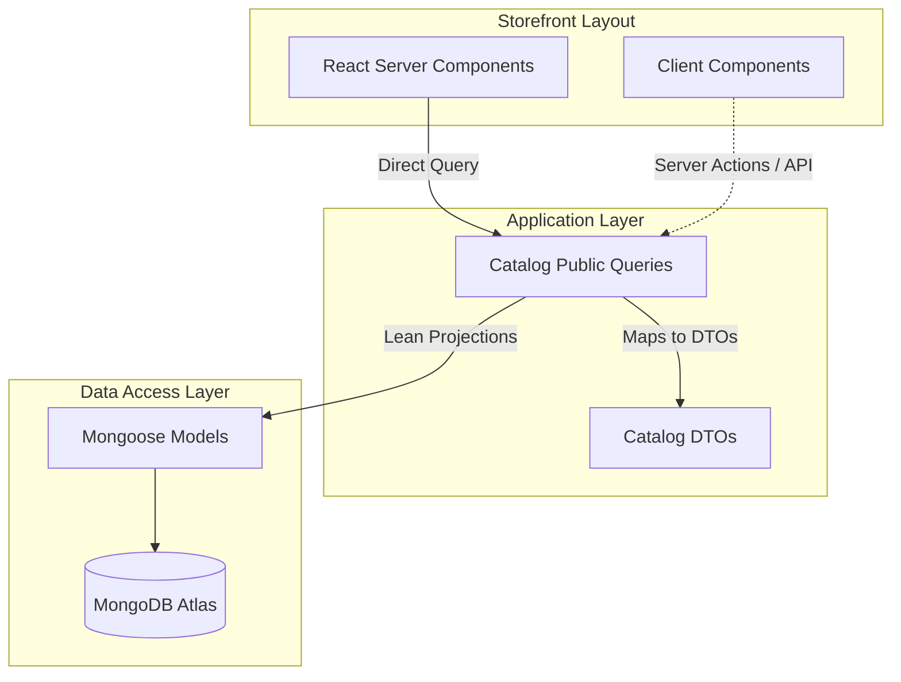

# Public Catalog Read Layer Specification & Architecture

This document provides a comprehensive technical overview of the implementation, data models, validation controls, security boundaries, and caching mechanisms engineered for the **Public Catalog Read Layer** of the Afnan e-commerce platform.

---

## 1. Architectural Overview & Responsibility

The Public Catalog Read Layer acts as the storefront's query engine. It provides the front-end with clean, secure, and performant data structures to render search results, filters, categories, and detail views.

To prevent architectural bleeding, the read layer enforces three core rules:
1. **RSCs Call DAL Directly**: React Server Components (RSC) fetch catalog data directly using module queries/repositories. They do not execute internal HTTP Route Handlers.
2. **Client Components Do Not Access Models**: Under no circumstances do Client Components import Mongoose models or query the database directly. All interactions go through Server Actions or queries exposed in public contracts.
3. **Projection-Only Outputs**: No database document structure or administrative metadata is leaked. Data is mapped to strict, serialization-safe Data Transfer Objects (DTOs).



---

## 2. Data Models & Indexing Strategy

### 2.1 Mongoose Schemas

#### Categories Schema (`CategoryModel`)
Represented in Mongoose under `src/modules/categories/model.ts` with fields:
- `name` (String, required): Public name of the category.
- `slug` (String, required, unique): URL identifier.
- `description` (String, optional): Category details.
- `image` (MediaAsset, optional): Nested schema for image representation.
- `sortOrder` (Number, required): Numeric order for category navigation.
- `isActive` (Boolean, required): Master status switcher.

**Indexes**:
- Unique index on `slug` (implicit via schema `unique: true`).
- Compound index `{ isActive: 1, sortOrder: 1 }` (for navigation listings).

#### Products Schema (`ProductModel`)
Represented in Mongoose under `src/modules/products/model.ts` with fields:
- `name`, `slug` (String, required): Basic identifiers. Unique constraint on `slug`.
- `description` (String, required): Detailed product copy.
- `categoryId` (ObjectId, ref: "Category", required): Reference link to category.
- `status` (String, enum: `["DRAFT", "ACTIVE", "ARCHIVED"]`, default: `"DRAFT"`).
- `fulfillmentType` (String, enum: `["READY_MADE", "MADE_TO_ORDER"]`, required).
- `basePriceAmount` (Number, required): Default pricing in EGP integer minor units.
- `currency` (String, enum: `["EGP"]`, default: `"EGP"`).
- `materials` (Array of Strings): Material composition.
- `colors` (Array of Strings): Available color names.
- `tags` (Array of Strings): Classification tags.
- `dimensions` (Optional object): Physical width, height, depth, and `unit: "cm"`.
- `personalizationAvailable` (Boolean): Switch for custom customer options.
- `personalizationInstructions` (String, optional).
- `preparationDaysMin`, `preparationDaysMax` (Number, optional).
- `careInstructions` (String, optional).
- `images` (Array of `MediaAssetSchema`).
- `variants` (Array of Variant Subdocuments):
  - `sku` (String, required): Unique identifier code.
  - `label` (String, required): User-facing description (e.g. "Size Large").
  - `optionValues` (Map of String to String): E.g., `{"size": "Large", "color": "Blue"}`.
  - `priceAmount` (Number, optional): Price override in minor units.
  - `stockQuantity` (Number, optional): Required for `READY_MADE`.
  - `isActive` (Boolean): Active indicator.

**Indexes**:
- Unique index on `slug`.
- Unique sparse index on `variants.sku` across the collection.
- Compound index `{ status: 1, categoryId: 1, publishedAt: -1 }` (optimizes paginated category feeds).
- Compound index `{ status: 1, basePriceAmount: 1 }` (optimizes price filter queries).
- Weighted multi-field text index on `{ name: "text", description: "text", materials: "text", colors: "text", tags: "text" }`.

---

## 3. Product Rules & Domain Cases

### 3.1 Variant Price Resolution
To avoid redundant price duplication across variants, the system resolves pricing using a fallback hierarchy on the server:
- If a variant has a `priceAmount` override defined, the variant uses this price.
- Otherwise, the variant falls back to the product's `basePriceAmount`.

This is resolved inside `mapProductToDetailDTO` before returning to the frontend:
```typescript
const priceAmount = typeof v.priceAmount === "number" 
  ? v.priceAmount 
  : doc.basePriceAmount;
```

### 3.2 Ready-Made vs. Made-to-Order Stock
The platform supports two fulfillment strategies with distinct stock rules:
- **`READY_MADE` (Stock-Bound)**:
  - Requires physical inventory.
  - Exposes variant `stockQuantity` to the frontend DTO for validation and quantity UI controls.
  - The `inStock` card flag is resolved based on whether there is *at least one* active variant with `stockQuantity > 0`.
- **`MADE_TO_ORDER` (Preparation-Bound)**:
  - Does not rely on stock.
  - Variant `stockQuantity` is strictly forced to `undefined` in public DTOs, masking internal database values.
  - Exposes `preparationDaysMin` and `preparationDaysMax` so the storefront can communicate delivery windows to customers.
  - The `inStock` card flag is statically hardcoded to `true` (made-to-order items are always available unless draft/archived).

---

## 4. Security & Validation Boundaries

### 4.1 Input Sanitization & Zod Validation
The dynamic search and listing filters are guarded by `catalogFiltersSchema` (Zod) inside `src/modules/catalog/schemas.ts`:
- Checks bounds on numbers (page numbers, limit sizes).
- Caps lists and search pagination at a strict ceiling of `100` items to prevent DDoS memory exhaustion.
- Strips MongoDB operator tokens (like `$`) from user text inputs to prevent NoSQL query injection:
  ```typescript
  search: z.string().trim().transform((val) => val.replace(/[$]/g, "")).optional()
  ```

### 4.2 Inactive Category Pruning
If a category is marked `isActive: false` by an admin:
1. Direct category lookups (`getCategoryBySlug`) will throw a `NotFoundError` (404).
2. Product detail queries (`getProductBySlug`) for products belonging to this category will throw a `NotFoundError` (404).
3. The catalog query will load active categories first and restrict products to those categories:
   ```typescript
   const activeCategories = await CategoryModel.find({ isActive: true }).select("_id").lean();
   query.categoryId = { $in: activeCategoryIds };
   ```
This guarantees that if a category is disabled, all nested products disappear from navigation feeds, search results, and cards instantly.

### 4.3 Safe Exception Masks
If a slug is missing, inactive, or draft, the layer raises a custom `NotFoundError` (extending `AppError` with a clean `NOT_FOUND` error code). Stack traces, MongoDB client details, and server variables are intercepted by `withApiHandler` and `errorToApiResponse` to prevent leakage.

---

## 5. Storefront Caching & Invalidation Strategy

Public reads that are highly static are cached using Next.js `unstable_cache` to bypass database hits and optimize response times.

For a complete breakdown of caching taxonomy, dynamic tag resolution (the Metadata Resolver Pattern), lifetime configuration (TTLs), eviction helpers, and testing, please refer to the dedicated [caching-architecture.md](file:///d:/JS/Next.js/Afnan/docs/caching-architecture.md) documentation.

