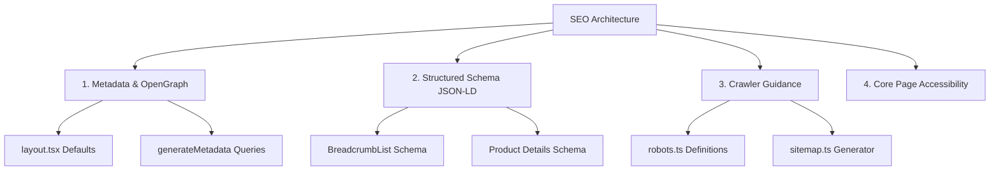

# Search Engine Optimization (SEO) Architecture

This document outlines the SEO implementation, search crawler guidance, meta tag strategies, OpenGraph protocol, and structured schema details engineered for the **Afnan** handmade products e-commerce platform.

---

## 1. Architectural Strategy

The platform relies on native Next.js metadata handling, dynamic sitemaps, semantic HTML5 layouts, and Google Rich Snippet integration to drive organic search visibility. The architecture splits SEO into four distinct pillars:



---

## 2. Metadata & OpenGraph Strategies

Next.js App Router handles server-rendered metadata tags dynamically. This ensures search engine crawlers receive complete title, description, and preview assets during the initial HTTP response without relying on client-side JavaScript execution.

### 2.1 Global Fallbacks
Global baseline fallback tags are configured statically in the root layout: [layout.tsx](file:///d:/JS/Next.js/Afnan/src/app/layout.tsx):
*   **Default Title**: `"Afnan — Handmade E-Commerce"`
*   **Default Description**: `"Egypt-only handmade-products e-commerce platform."`

### 2.2 Static Pages
Static auth pages (e.g. Login, Register, Recovery) specify static `metadata` objects to ensure search engines index them with clean user-facing titles and exclude administrative sub-routes when needed.

### 2.3 Dynamic Metadata Generation (`generateMetadata`)
Category feeds, shop lists, and product detail views use Next.js's dynamic `generateMetadata` query hooks. This queries details server-side and outputs page-specific parameters.

#### 1. Product Detail Pages ([product/[slug]/page.tsx](file:///d:/JS/Next.js/Afnan/src/app/(store)/product/[slug]/page.tsx))
*   **Dynamic Title**: `{Product Name} — Afnan`
*   **Dynamic Description**: Truncates the product description safely to under 160 characters.
*   **Canonical URL**: Formulates strict canonical metadata matching `https://{domain}/product/{product.slug}` to avoid duplicate content penalties.
*   **OpenGraph Media**: Maps all product image arrays to `og:image` meta links dynamically.

#### 2. Category Pages ([category/[slug]/page.tsx](file:///d:/JS/Next.js/Afnan/src/app/(store)/category/[slug]/page.tsx))
*   **Dynamic Title**: `{Category Name} — Afnan` (Appends search query filters when active: `Search "{searchQuery}" in {Category Name} — Afnan`).
*   **Dynamic Description**: Fallback to category descriptions or customized query-specific text snippets.
*   **Canonical URL**: Resolves canonical identifiers matching the category endpoint routing.

---

## 3. Structured Schema Data (JSON-LD)

To stand out in Google Search with rich badges (like price displays, ratings, stock indicators, and breadcrumb trails), the storefront renders structured JSON-LD schemas inside the page head using the [ProductStructuredData](file:///d:/JS/Next.js/Afnan/src/components/catalog/product-structured-data.tsx) component.

The component outputs two Google-compliant schemas:

### 3.1 BreadcrumbList Schema
Guides search engine crawlers on the structure and nesting of paths:
```json
{
  "@context": "https://schema.org",
  "@type": "BreadcrumbList",
  "itemListElement": [
    { "@type": "ListItem", "position": 1, "name": "Home", "item": "https://afnan.eg/" },
    { "@type": "ListItem", "position": 2, "name": "Clay Pots", "item": "https://afnan.eg/category/clay-pots" },
    { "@type": "ListItem", "position": 3, "name": "Handmade Clay Jug", "item": "https://afnan.eg/product/handmade-clay-jug" }
  ]
}
```

### 3.2 Product Details Schema
Configures complete commercial parameters:
*   **Pricing Conversion**: The database stores currency in EGP integer minor units (e.g., `15000` for EGP 150.00). The structured schema resolves this using `.toFixed(2)` format (e.g., `150.00`) and associates it with the `priceCurrency: "EGP"` property.
*   **Availability Mapping**: Evaluates the fulfillment rules on the server. If `fulfillmentType` is `MADE_TO_ORDER` or there is at least one active variant with `stockQuantity > 0`, it assigns `https://schema.org/InStock`. Otherwise, it marks `https://schema.org/OutOfStock`.
*   **Country Boundaries**: The offer includes shipping destination metadata restricted to `"EG"` (Egypt), reflecting our Egypt-only shipping constraint.

---

## 4. Crawler Guidance (Robots & Sitemaps)

To direct index bots to useful consumer listing pages while blocking search engine pollution from internal operations, the root folder exposes two dynamic routing paths:

### 4.1 Crawler Policies ([robots.ts](file:///d:/JS/Next.js/Afnan/src/app/robots.ts))
Exposes the standard `/robots.txt` configuration:
*   **Allow**: Permits crawl requests for all public storefront paths (shop listings, homepage, category listings, detail views).
*   **Disallow**: Blocks search crawlers from inspecting or indexing admin pages (`/admin/*`) and private profiles/checkout routes.
*   **Sitemap Binding**: Directs crawlers to the official sitemap endpoint.

### 4.2 Site Map XML ([sitemap.ts](file:///d:/JS/Next.js/Afnan/src/app/sitemap.ts))
Generates the `/sitemap.xml` resource mapping. 
*   *Implementation Strategy*: Includes the storefront root path. It is planned to pull active category links and active product slug parameters dynamically from MongoDB to build index mapping arrays.

---

## 5. SEO Coding Guidelines for Developers

To maintain excellent SEO scores, all developers must adhere to the following front-end guidelines:

1.  **Strict Semantic Hierarchy**:
    *   Exactly one `<h1>` per page (typically the page or catalog title).
    *   Nest sections using `<h2>`, `<h3>` sequentially. Do not jump heading levels for visual styling (use Tailwind classes to style typography sizes, keeping semantic elements clean).
2.  **Required Image Attributes**:
    *   Always use the Next.js custom `<Image>` wrapper (`next/image`).
    *   Always supply meaningful, descriptive `alt` text to enable image index crawling. Do not use generic alt texts like `"image"` or `"product"`.
3.  **Preventing Layout Shifts**:
    *   Maintain fixed aspect ratios (such as the standard `4:5` product card ratio) using `object-contain` and responsive sizing. This prevents CLS (Cumulative Layout Shift) index penalties.
4.  **Relative Link Safety**:
    *   Use relative routing paths inside components to keep search bots navigating smoothly without triggering external redirect flags.
